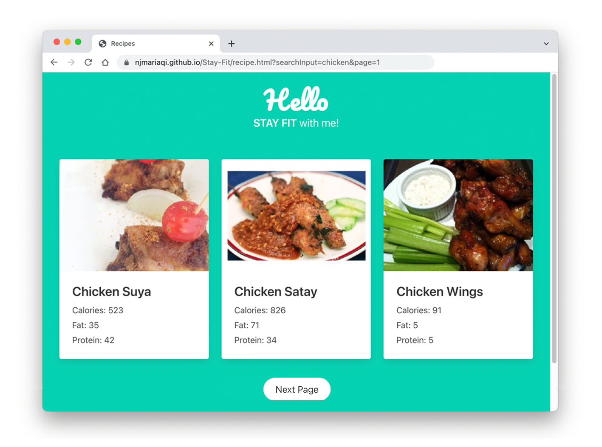
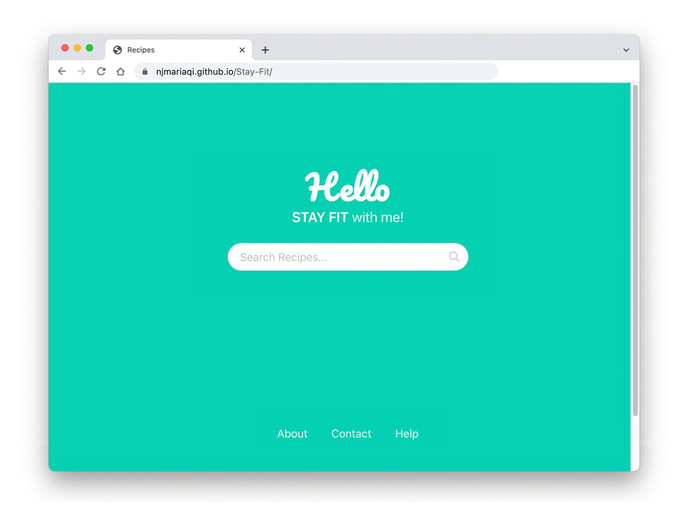
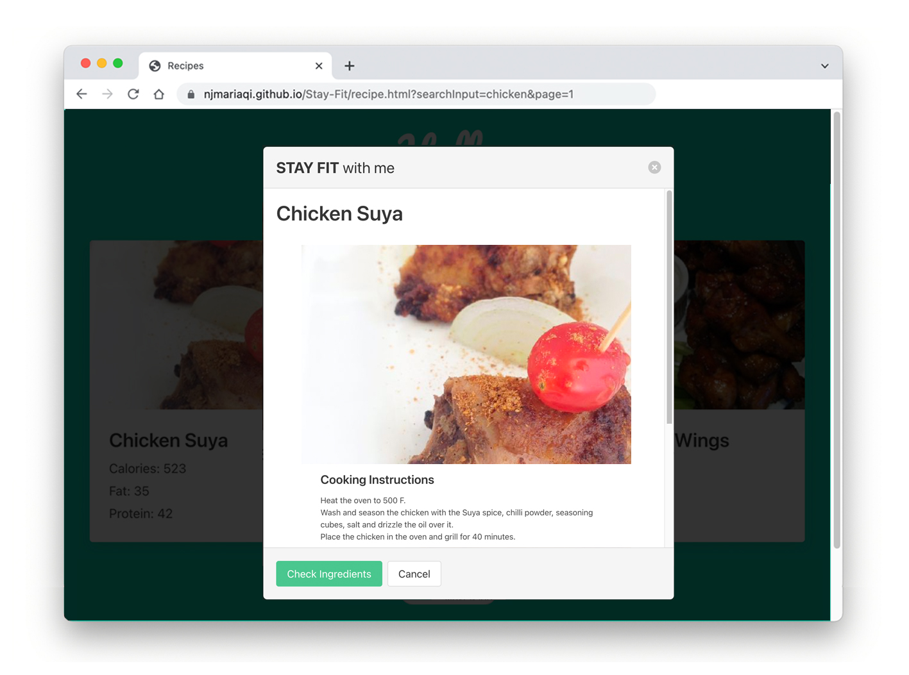
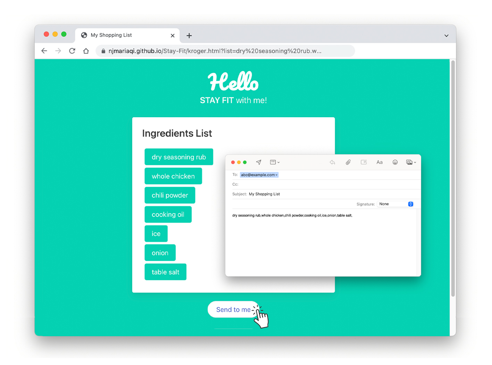

# **Stay Fit, healthy recipe finder and shopper**

## **[🔗 Demo Here](https://njmariaqi.github.io/Stay-Fit/)**

### Stay Fit allows users to search for low calorie recipes and create shopping list based on search result

## **About The Project**

### Stay Fit uses [Spoonacular](https://spoonacular.com/) API and help user find recipes, understand its nutrition fact and create shopping list based on the result.

### User could:

- search recipes by name or ingredient
- compare calorie, protein and etc between different dishes
- create shopping list based on selected recipe and send to user's email

  

## **Built with**

- Javascript
- HTML
- CSS
- Spoonacular API
- Bulma

## **License**

Distributed under the MIT License.

## **Contact**

Maria Qi
